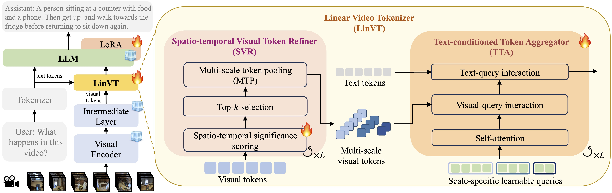

# LinVT: Empower Your Image-level Large Language Model to Understand Videos

## News
[2024/12/09] 🔥 Our paper is coming! We release our paper on [Arxiv](https://arxiv.org/abs/2412.05185). Please refer to the paper for more details. 

<p align="center">
 
</p>

## 📖 Abstract
Large Language Models (LLMs) have been widely used in various tasks, motivating us to develop an LLM-based assistant for videos. Instead of training from scratch, we propose a module to transform arbitrary well-trained image-based LLMs into video-LLMs (after being trained on video data). To better adapt image-LLMs for processing videos, we introduce two design principles: linear transformation to preserve the original visual-language alignment and representative information condensation from redundant video content. Guided by these principles, we propose the Linear Video Tokenizer (LinVT), which enables existing image-LLMs to understand videos. We benchmark LinVT with six recent visual LLMs: Blip-3, Molmo, Mipha, InternVL2, Qwen2-VL and Aquila, show-casing the high compatibility of LinVT. Extensive experiments illustrate the effectiveness of LinVT in multi-modal video understanding while preserving the original image-comprehension capabilities.

## Installation
Install required packages. 

```bash
conda create -n LinVT python=3.10.13
conda activate LinVT
conda install pytorch==1.13.1 torchvision==0.14.1 torchaudio==0.13.1 -c pytorch -c conda-forge -y
pip install -r requirements.txt
```
